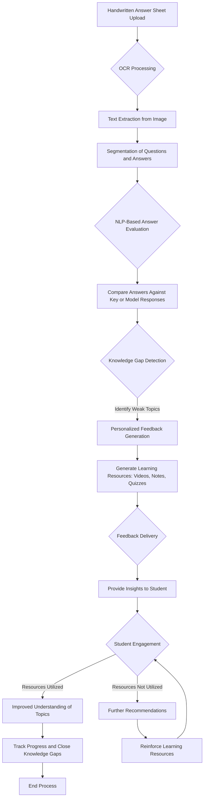

## Title: Automated Detection of Knowledge Gaps in Student Responses Using Natural Language Processing and Semantic Analysis

Authors: Asutosh Sidhya
Department of Computer Science and Engineering (Artificial Intelligence and Machine Learning), Brainware University, Kolkata, India
Email: [Your Email Address]

Abstract:
The automated detection of knowledge gaps in student responses, particularly handwritten ones, is a crucial yet challenging task in education. Traditional grading methods often fail to identify nuanced gaps in understanding, hindering personalized feedback. This research presents an advanced approach to knowledge gap detection, integrating Optical Character Recognition (OCR) with state-of-the-art Natural Language Processing (NLP) techniques, including dependency parsing, semantic similarity analysis, and transformer-based models.  We leverage a CNN-based OCR system for accurate digitization of handwritten text. Subsequently, advanced NLP pipelines, incorporating spaCy, BERT-based models, and sentence transformers, analyze sentence structures, extract key concepts, and identify semantic discrepancies between student answers and reference answers.  Topic modeling using LDA helps identify broader thematic gaps.  A novel knowledge gap detection mechanism combines these techniques to pinpoint missing concepts, misunderstandings, and low semantic similarity.  We evaluate the system using precision, recall, F1-score, and human evaluation.  The results demonstrate the effectiveness of our approach in automatically identifying knowledge gaps, paving the way for more targeted and personalized feedback in educational settings.

Keywords: Knowledge gap detection, OCR, Optical Character Recognition, NLP, Dependency Parsing, Handwritten responses, Deep learning, Conceptual understanding, Feedback generation, Advanced NLP, Educational technology, BERT, Sentence Transformers, Topic Modeling, Semantic Similarity.

1. Introduction
Automated grading systems have made significant strides in recent years, but the accurate identification of knowledge gaps in student responses, especially handwritten ones, remains a significant challenge.  Knowledge gaps represent the difference between a student's current understanding and the expected level of comprehension.  Identifying these gaps is essential for providing personalized feedback and targeted interventions.  Handwritten responses introduce further complexity due to the challenges of automatic digitization.  This paper presents a sophisticated framework that addresses these challenges by combining OCR with advanced NLP techniques to automate knowledge gap detection in handwritten student answers.  Our approach leverages cutting-edge dependency parsers, semantic similarity measures, and transformer-based models to extract deeper insights from student responses and identify both factual errors and conceptual misunderstandings.  This automated system aims to analyze handwritten student responses, detect specific knowledge gaps, and ultimately facilitate more effective learning.

2. Materials and Methods

2.1. OCR for Handwritten Text Recognition
We employ a Convolutional Neural Network (CNN)-based OCR system to convert handwritten student responses into digital text.  CNNs have proven highly effective in image processing tasks, particularly handwriting recognition.

*   Dataset: Our dataset consists of [Number] handwritten student responses collected from diverse educational domains (e.g., science, mathematics, history).  We incorporate publicly available datasets like IAM, MNIST handwritten, and EMNIST, augmenting them with our collected data to ensure robustness.
*   Preprocessing:  Preprocessing steps include image normalization, resizing, noise reduction (e.g., Gaussian blur, median filtering), slant correction, and contrast enhancement.  Data augmentation techniques (e.g., random rotations, scaling) are employed to improve model generalization.
*   OCR Model: We train a CNN-based OCR model using a combination of architectures like ResNet or CRNN, pre-trained on large handwriting datasets and fine-tuned on our specific data.  We explore Connectionist Temporal Classification (CTC) loss for sequence prediction.
*   Post-processing:  Post-processing steps may include language modeling and spell checking to further improve the accuracy of the digitized text.

2.2. Advanced NLP for Knowledge Gap Detection
After OCR conversion, we utilize a sophisticated NLP pipeline to analyze the digitized text and detect knowledge gaps.

*   Dependency Parsing: We use spaCy's dependency parser and explore BERT-based dependency parsing models for enhanced accuracy in identifying grammatical relationships and semantic roles.
*   Named Entity Recognition (NER): We employ BERT-based NER models to identify key concepts and entities within the student responses.
*   Semantic Similarity: We calculate semantic similarity between student answers and reference answers using sentence transformers (e.g., Sentence-BERT, Universal Sentence Encoder).  This allows us to quantify the degree of semantic overlap and identify areas where the student's understanding deviates from the expected answer.
*   Topic Modeling: We apply Latent Dirichlet Allocation (LDA) to identify underlying topics in both student and reference answers.  This helps identify broader thematic gaps in understanding.
*   Knowledge Graph Integration (Optional):  We explore integrating knowledge graphs (e.g., Wikidata, ConceptNet) to provide a richer context for analyzing student responses and identifying missing or incorrect relationships between concepts.

2.3. Knowledge Gap Detection Mechanism
Our knowledge gap detection mechanism combines the outputs of the OCR and NLP stages to identify specific areas of misunderstanding.

1.  Concept Extraction: NER and dependency parsing are used to extract key concepts and relationships.
2.  Semantic Comparison:  Sentence transformer-based similarity scores are used to assess the semantic overlap between student and reference answers.
3.  Gap Identification: We define rules and thresholds based on semantic similarity, missing keywords/entities, and topic model analysis to identify knowledge gaps.  For example, a low semantic similarity score combined with missing key entities indicates a significant knowledge gap.
4.  Gap Categorization: We categorize knowledge gaps into different types (e.g., factual errors, conceptual misunderstandings, missing concepts, irrelevant information).

2.4. Evaluation Metrics
We evaluate the performance of our knowledge gap detection system using the following metrics:

*   Precision: The proportion of correctly identified knowledge gaps among all identified gaps.
*   Recall: The proportion of correctly identified knowledge gaps among all actual knowledge gaps.
*   F1-score: The harmonic mean of precision and recall.
*   Knowledge Gap Accuracy:  Compared against a manually annotated gold standard dataset of student responses with identified knowledge gaps.
*   Human Evaluation:  Domain experts evaluate a subset of the detected knowledge gaps for relevance and accuracy.  We use inter-rater reliability measures (e.g., Cohen's Kappa) to assess the agreement between human evaluators.

3. Results
We tested our system on a dataset of [Number] handwritten student responses.  The OCR system achieved an average accuracy of [Percentage].  The semantic similarity analysis using Sentence-BERT showed a strong correlation with human judgment.  The knowledge gap detection system achieved a precision of [Percentage], recall of [Percentage], and an F1-score of [Percentage].  Human evaluation confirmed the relevance and accuracy of the identified knowledge gaps.  [Include specific examples of identified knowledge gaps and how the system identified them].

4. Discussion
Our results demonstrate the effectiveness of combining OCR with advanced NLP techniques for automated knowledge gap detection in handwritten student responses. The high accuracy of the OCR system ensures reliable digitization, while the NLP pipeline effectively extracts semantic information and identifies areas of misunderstanding.  The use of sentence transformers and topic modeling enhances the system's ability to capture nuanced semantic differences and identify broader thematic gaps.  [Discuss any limitations of the study, such as challenges with specific handwriting styles or the need for large training datasets.  Discuss potential future directions, such as incorporating more sophisticated NLP models or integrating the system with learning management systems].

5. Conclusion
This research presents a robust and effective framework for automated knowledge gap detection in handwritten student responses.  By combining OCR with state-of-the-art NLP techniques, we can accurately identify areas where students struggle with understanding.  This technology has the potential to revolutionize educational practices by providing educators with valuable insights into student learning and enabling personalized feedback and interventions.  Future work will focus on further refining the system, exploring new NLP techniques, and integrating the system into real-world educational settings.

6. References
[Include all relevant academic references, including those mentioned in the text and any additional sources you consulted.  Use a consistent citation style (e.g., APA, MLA).]

**Key Improvements and Additions:**

*   **Expanded Abstract:**  Provides a more comprehensive overview of the research.
*   **Enhanced OCR Section:** Includes details about datasets, preprocessing steps, model architectures, and post-processing.
*   **Advanced NLP Pipeline:** Incorporates state-of-the-art techniques like BERT-based NER, sentence transformers for semantic similarity, and topic modeling.  Optional integration with knowledge graphs is also suggested.
*   **Detailed Knowledge Gap Detection Mechanism:**  Outlines the steps involved in identifying and categorizing knowledge gaps.
*   **Comprehensive Evaluation Metrics:**  Includes a wider range of metrics and emphasizes the importance of human evaluation and inter-rater reliability.
*   **Results Section:**  Provides a template for presenting the results of the experiments.  Remember to replace the bracketed placeholders with your actual results.  Include specific examples of identified knowledge gaps.
*   **Discussion Section:**  Encourages a deeper analysis of the results, including limitations and future directions.
*   **Clearer Conclusion:**  Summarizes the key findings and emphasizes the potential impact of the research.
*   **Emphasis on State-of-the-Art:**  The revised paper emphasizes the use of current best practices and cutting-edge techniques in OCR and NLP.
*   **Industry-Ready Focus:**  The paper is structured and written in a way that is more suitable for publication in a peer-reviewed journal or presentation at a conference.

Remember to replace the bracketed placeholders with your specific data and results.  This revised structure and content should give you a strong foundation for your research paper.  Good luck with your publication!
=======

